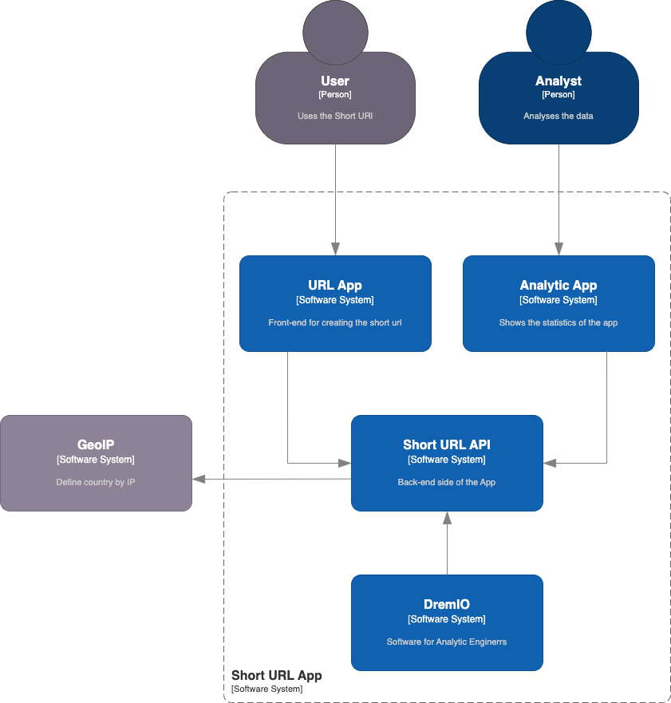

# Short Url

Проект позволяет сокращать длинные ссылки более коротким вариантом.

## Архитектура

<details close>
  <summary>
    C4 - Context
  </summary>

  
</details>

<details close>
  <summary>
    C4 - Container
  </summary>

  
</details>

## Запуск

Для запуска выпоняем команду:

```
docker compose -f docker-compose.base.yml
               -f apps/auth/docker-compose.yml
               -f apps/user/docker-compose.yml
               -f apps/short-url/docker-compose.yml
               up -d
```

## Подключение к базе данных

```
docker exec -it short_url_db bash
psql -h <host> -U <user> -d <db>

# chose db
\c short_url_db

# show tables
\dt
```